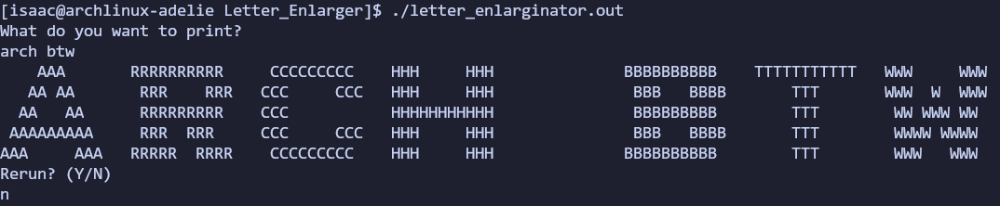

# Letter Enlarginator
It takes a string and  
prints the string in  
large ASCII Letters

its main use is making a fancy header when executing a program.

it currently only supports the alphabet, space, and a few other characters.  
there are some plans for unicode characters but i need to learn to parse those (they are too large for `char` variables)

